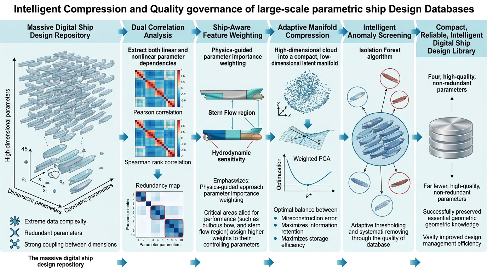

# LieHullDynamics
## Lie-Geometric Representation and Dynamic Evolution Modeling for Ship Hull Shapes



This repository provides the experimental implementation of a Lie-geometric framework for ship hull shape representation, deformation analysis, geometric retrieval, and latent dynamic evolution modeling.

The project investigates how continuous hull shape variations can be represented in a compact latent space by combining geometric representation learning with Lie-based deformation modeling and Koopman dynamic analysis.

The framework includes:

- Point-cloud based hull shape representation
- PCA latent embedding for compact geometric encoding
- Lie-inspired deformation representation between latent states
- Koopman operator based latent evolution modeling
- Geometry-aware retrieval evaluation
- Compression and reconstruction analysis
- Ablation studies and computational complexity evaluation


# Framework Overview

Traditional ship hull representation methods mainly rely on raw Euclidean coordinates, handcrafted descriptors, or static dimensionality reduction methods.

However, hull design processes often involve continuous geometric modifications, where different design states may exhibit nonlinear deformation relationships.

This project explores a geometric dynamic representation framework:


```
             Input
               |
               v
      Raw Hull Mesh Dataset
               |
               v
      Point Cloud Sampling
               |
               v
      Shape PCA Embedding
               |
               v
   Latent Deformation Representation
               |
               v
      Koopman Dynamic Modeling
               |
      +--------+---------+
      |                  |
      v                  v
```

Shape Retrieval    Evolution Analysis

```


# Main Components

## 1. Hull Shape Representation

All hull geometries are uniformly converted into point clouds and mapped into a compact latent representation.

| Parameter | Value |
| ---- | ---- |
| Sampled points per hull mesh | 1000 |
| Latent embedding dimension | 45 |
| Sequential latent samples | 1000 |


## 2. Latent Deformation Representation

The latent deformation between adjacent hull states is represented as:

\[
\Delta z_t = z_{t+1}-z_t
\]

The deformation representation aims to characterize continuous geometric transitions between neighboring hull configurations.

The current implementation focuses on data-driven latent deformation analysis and does not impose explicit hydrodynamic or structural constraints.


## 3. Koopman Dynamic Modeling

A linear Koopman operator is estimated in the latent space:

\[
z_{t+1}=Kz_t
\]

The operator is used for:

- latent trajectory analysis;
- multi-step evolution prediction;
- spectral property investigation.


# Dataset Notice

> ⚠️ **The ShipD dataset is not included in this repository.**

Users need to independently obtain the ShipD ship hull dataset and place the mesh data in the designated directory.

The repository only contains:

- source code;
- experimental configuration;
- visualization scripts;
- generated analysis templates.


# Repository Structure

```

LieHullDynamics/

│
├── code/
│   └── lie_hull_dynamics.py
│
├── data/
│   └── ShipD dataset location
│
├── exp_tables/
│   ├── dataset/
│   ├── latent/
│   ├── retrieval/
│   ├── ablation/
│   ├── compression/
│   └── complexity/
│
├── figures/
│
├── README.md
└── requirements.txt

```


# Experimental Evaluation

All experimental results are automatically saved into:

```

exp_tables/

```

and visualization results are stored in:

```

figures/

```


## Latent Representation Analysis

Evaluation includes:

- latent dimension analysis;
- reconstruction fidelity;
- compression characteristics.


## Retrieval Benchmark

Compared methods include:

- Euclidean distance matching
- Hash embedding
- Mesh Laplacian spectrum
- PCA latent representation
- Random Forest based descriptor
- Lie-based latent representation


Evaluation metrics:

- Recall@K
- NDCG@K
- mAP


## Compression Evaluation

The compression experiments analyze:

- storage efficiency;
- reconstruction error;
- compression-fidelity trade-off.


## Ablation Studies

The contribution of each component is evaluated through:

1. PCA latent representation
2. Geometric feature augmentation
3. Latent deformation representation
4. Koopman dynamic modeling
5. Full integrated framework


## Complexity Analysis

Computational complexity is analyzed for:

- PCA embedding;
- deformation representation;
- Koopman estimation;
- retrieval inference.


# Requirements

Python >= 3.9

```

numpy
scipy
pandas
matplotlib
scikit-learn
trimesh
umap-learn
tqdm

````

Install dependencies:

```bash
pip install -r requirements.txt
````

# Running Experiments

After downloading the ShipD dataset:

```bash
python code/lie_hull_dynamics.py
```

Generated outputs:

```
figures/
    visualization results

exp_tables/
    quantitative experimental results
```

# Current Limitations

The current implementation has several limitations.

## 1. Data-driven deformation representation

The deformation representation is constructed from latent-space variations. It does not explicitly incorporate physical constraints from hydrodynamics, structural mechanics, or manufacturing rules.

Therefore, deformation modes should be interpreted as geometric patterns rather than strict physical deformation operators.

## 2. Limited compression advantage

For pure reconstruction-based compression tasks, the Lie-based representation does not necessarily outperform standard PCA at identical latent dimensions.

The main motivation of the framework is not only compression, but also:

* continuous deformation analysis;
* latent interpolation;
* geometric evolution interpretation.

## 3. Long-term evolution prediction

Koopman-based evolution modeling provides a linear approximation in latent space.

Long-term prediction may require:

* stronger regularization;
* physics-informed constraints;
* nonlinear dynamic operators.

## 4. Retrieval performance

For basic similarity retrieval, Lie latent features may provide limited improvement compared with static PCA features.

The potential advantage lies in:

* deformation-aware retrieval;
* shape interpolation;
* editable latent evolution modeling.

# Citation

If you find this repository useful, please cite:

```bibtex
@software{LieHullDynamics,
  title={LieHullDynamics: Lie-Geometric Representation and Dynamic Evolution Modeling for Ship Hull Shapes},
  author={Harmenlv etc},
  year={2026},
  url={https://github.com/yourname/LieHullDynamics}
}
```

# License

MIT License

# Acknowledgements

This repository contains the implementation and experimental analysis developed by the author.

The ShipD ship hull dataset is not redistributed and must be obtained from its original source.

Have a nice day.
