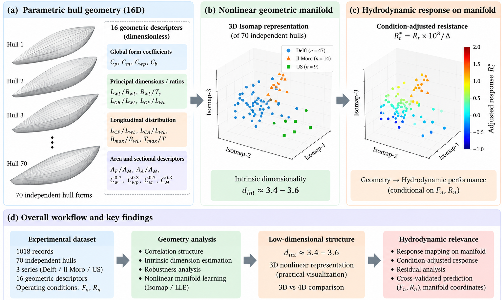

# LieHullDynamics
## Intrinsic Geometry and Nonlinear Manifold Representation of Experimental Sailboat Hulls

<p align="center">
  
</p>

<p align="center">
  <em>
  Schematic representation of the independent-hull representation used in this study
  </em>
</p>

---

<p align="center">
  <em>
  Hierarchical structure of the experimental sailboat-hull population and its
  independent-hull representation
  </em>
</p>

<p align="center">
  <em>
  Hierarchical structure of the experimental sailboat-hull population and its
  independent-hull representation
  </em>
</p>

---

## Overview

This repository provides the experimental implementation and analysis
materials for studying the intrinsic geometric structure of experimental
sailboat hull design spaces.

The central question investigated in this work is:

> **Does a high-dimensional parametric description of hull geometry imply an
> equally high number of independent geometric degrees of freedom?**

Rather than imposing a predefined dimensionality-reduction target, this
study treats intrinsic dimensionality as an empirical property of the
sampled hull-design population.

The analysis establishes the following evidence chain:

```text
16D Hull Geometry
        |
        v
70 Independent Hulls
        |
        v
Intrinsic-Dimensionality Estimation
        |
        v
Effective Dimension ≈ 3.4–3.6
        |
        v
Nonlinear Manifold Representation
        |
        v
3D / 4D Isomap Coordinates
        |
        v
Hydrodynamic Relevance
        |
        v
Hull-Level Cross-Validated Evaluation
````

The repository is designed to support reproducible analysis of:

* independent-hull geometric representation;
* intrinsic-dimensionality estimation;
* nonlinear manifold construction;
* robustness analysis;
* Isomap and LLE representations;
* three- versus four-dimensional embedding;
* hydrodynamic mapping using nonlinear geometric coordinates;
* hull-level cross-validation;
* supplementary statistical diagnostics.

---

# Important Naming Note

The repository name **LieHullDynamics** is retained from an earlier
research direction and is intended to accommodate possible future
extensions.

**Lie group, Lie algebra, and Lie-manifold formulations are not used in the
current experimental pipeline.**

The present work is based on:

* intrinsic-dimensionality estimation;
* nonlinear manifold learning;
* geometric representation;
* statistical robustness analysis;
* hydrodynamic validation.

Lie-geometric deformation modeling is considered a potential direction for
future research and should not be interpreted as a method implemented in
the current study.

---

# Scientific Problem

Parametric ship-hull descriptions may contain a relatively large number of
geometric descriptors. However, many descriptors can be statistically
dependent because they arise from common geometric constraints and
hydrodynamic design principles.

Consequently,

```text
Nominal dimensionality ≠ Effective dimensionality
```

This repository investigates whether the 16-dimensional geometric
representation of a real experimental sailboat-hull population occupies a
substantially lower-dimensional nonlinear structure.

The analysis is performed at the **independent-hull level** rather than at
the individual experimental-record level.

This distinction is important because multiple hydrodynamic measurements
may correspond to the same physical hull under different operating
conditions.

---

# Dataset

The main analysis uses the:

**Sailboat Hull Resistance Dataset**

The dataset contains:

| Quantity                          | Value |
| --------------------------------- | ----: |
| Hydrodynamic experimental records | 1,018 |
| Independent hulls                 |    70 |
| Geometric descriptors             |    16 |
| Experimental series               |     3 |

The three experimental series are:

| Series             |   Records | Independent hulls |
| ------------------ | --------: | ----------------: |
| Delft              |       702 |                47 |
| Il Moro di Venezia |       108 |                14 |
| US Sailing Series  |       208 |                 9 |
| **Total**          | **1,018** |            **70** |

The independent hull is identified using:

```text
(Serie, Sysser)
```

Therefore:

> **1,018 experimental records do not correspond to 1,018 independent
> geometric samples.**

The intrinsic-dimensionality analysis uses the 70 independent hulls as the
statistical units.

---

# Geometric Representation

Each independent hull is represented using 16 dimensionless geometric
descriptors.

The descriptors include:

```text
Cp
Cm
Cb
Cw
Lwl/Bwl
Bwl/Tc
Lwl/Tc
Lwl/Vol^(1/3)
Lcb/Lwl
Lcf/Lwl
Lcb/Lcf
Sc/Vol^(2/3)
Aw/Vol^(2/3)
Sc/Aw
Sc/Ax
Ax/Aw
```

Operating-condition variables such as:

```text
Fn
Rn
```

are not treated as geometric dimensions.

The measured hydrodynamic response is represented by:

```text
Rt*10^3 / Delta
```

---

# Methodological Framework

The core computational framework is summarized as:

```text
Experimental Records
        |
        v
Independent-Hull Aggregation
        |
        v
16D Geometric Representation
        |
        +-----------------------+
        |                       |
        v                       v
Intrinsic-Dimension         Conventional
Estimation                  Linear Reference
        |                       |
        v                       v
Robustness Analysis             PCA
        |
        v
Nonlinear Manifold Learning
        |
        +-------------+
        |             |
        v             v
      Isomap         LLE
        |
        v
3D / 4D Nonlinear Coordinates
        |
        v
Hydrodynamic Mapping
        |
        v
Hull-Level 5-Fold Cross-Validation
```

The mathematical evolution of the analysis can be summarized as

$$
\mathcal{D}
\xrightarrow{\phi}
\mathcal{H}
\xrightarrow{\mathbf{x}\in\mathbb{R}^{16}}
\mathbf{X}
\xrightarrow{\operatorname{ID}}
\widehat d_{\mathrm{int}}
\approx 3.4\text{--}3.6
\xrightarrow{\operatorname{Manifold}}
\mathbf{U}^{(q)}
\in\mathbb{R}^{q},
\qquad q\in\{3,4\}.
$$

The resulting nonlinear coordinates are subsequently evaluated together
with the operating conditions $(F_n,R_n)$ through hull-level cross-validation.

---

# 1. Intrinsic-Dimensionality Estimation

The primary analysis uses local maximum-likelihood estimation (MLE) of
intrinsic dimensionality.

Several neighborhood sizes are examined to evaluate the stability of the
estimated dimension.

Representative estimates for the complete 70-hull population include:

| Neighborhood | MLE estimate |
| -----------: | -----------: |
|        k = 5 |        4.136 |
|        k = 7 |        3.846 |
|       k = 10 |        3.551 |
|       k = 12 |        3.494 |
|       k = 15 |        3.356 |
|       k = 20 |        3.467 |

The estimates remain in the approximate range:

```text
3.4 – 3.6
```

for moderate neighborhood scales.

Additional diagnostics include:

* TWO-NN;
* correlation-dimension diagnostic;
* leave-one-hull-out jackknife;
* subsampling without replacement;
* series-level diagnostics;
* leave-one-variable-out sensitivity analysis.

The result should be interpreted as an **effective intrinsic dimensionality
of the sampled experimental hull population**, rather than as an exact
mathematical proof that the underlying physical design space is a
3.5-dimensional manifold.

---

# 2. Robustness Analysis

The dimensionality estimate is evaluated under several perturbation
strategies.

## Leave-One-Hull-Out Jackknife

For MLE with `k = 10`:

```text
Mean   = 3.561
Std    = 0.038
Median = 3.565
95% range = [3.493, 3.629]
```

For MLE with `k = 15`:

```text
Mean   = 3.371
Std    = 0.026
Median = 3.369
95% range = [3.312, 3.416]
```

These results indicate that the dimensionality estimate is not dominated by
a single experimental hull.

---

## Subsampling Without Replacement

Repeated subsampling is performed without replacement to avoid duplicated
nearest neighbors and the associated zero-distance problem in k-nearest
neighbor intrinsic-dimensionality estimators.

### 80% subsampling

```text
MLE k=10
Median = 3.584
95% range = [3.309, 3.881]

MLE k=15
Median = 3.478
95% range = [3.257, 3.690]
```

### 90% subsampling

```text
MLE k=10
Median = 3.581
95% range = [3.402, 3.761]

MLE k=15
Median = 3.425
95% range = [3.296, 3.548]
```

---

## Leave-One-Variable-Out Sensitivity

Removing individual geometric descriptors gives:

```text
MLE k=10:
3.379 – 3.712

MLE k=15:
3.220 – 3.485
```

No single geometric descriptor is sufficient to explain the observed
low-dimensional structure.

---

# 3. Nonlinear Manifold Representation

After intrinsic-dimensionality analysis, nonlinear manifold learning is
used to obtain practical low-dimensional coordinates.

The primary nonlinear representation is based on:

```text
Isomap
```

with target dimensions:

```text
q ∈ {3, 4}
```

LLE is used as an additional nonlinear diagnostic.

PCA is retained only as a conventional linear reference.

The workflow is therefore:

```text
16D Geometry
      |
      v
Intrinsic Dimension ≈ 3.5
      |
      v
Nonlinear Manifold
      |
      +------------+
      |            |
      v            v
    Isomap        LLE
      |
      v
3D / 4D Coordinates
```

The nonlinear coordinates are not claimed to be unique physical
coordinates of the hull-design space.

They provide a compact data-driven representation of the observed geometric
variation.

---

# 4. Three- versus Four-Dimensional Representation

The study compares three- and four-dimensional Isomap representations.

The purpose is not to claim that the intrinsic dimension is exactly 3 or
exactly 4.

Instead, the comparison asks whether increasing the representation from
three to four nonlinear coordinates produces a substantial additional
benefit.

The results indicate that the fourth coordinate provides only a marginal
increment in hydrodynamic predictive performance.

This supports the practical use of a compact three-dimensional nonlinear
representation for the sampled hull population.

---

# 5. Hydrodynamic Relevance

A nonlinear geometric representation is useful only if it captures
variation that is relevant to the physical response.

Therefore, the repository includes a hull-level five-fold GroupKFold
cross-validation experiment.

Three models are compared:

```text
Model A:
(Fn, Rn)

Model B:
(Fn, Rn, Z1, Z2, Z3)

Model C:
(Fn, Rn, Z1, Z2, Z3, Z4)
```

where

```text
Z1, Z2, Z3, Z4
```

are nonlinear Isomap coordinates.

The same Random Forest regression configuration is used across the
comparison.

---

## Record-Level Cross-Validation

| Representation    |  CV R² |  RMSE |
| ----------------- | -----: | ----: |
| `(Fn, Rn)`        | 0.9567 | 10.09 |
| `(Fn, Rn, Z1-Z3)` | 0.9725 |  8.05 |
| `(Fn, Rn, Z1-Z4)` | 0.9734 |     — |

Adding three nonlinear geometric coordinates increases the record-level
cross-validated R² from:

```text
0.9567 → 0.9725
```

and reduces RMSE from approximately:

```text
10.09 → 8.05
```

---

## Hull-Level Cross-Validation

The independent-hull level provides the more conservative evaluation.

| Representation    | Hull-level R² | Hull-level MAE |
| ----------------- | ------------: | -------------: |
| `(Fn, Rn)`        |        0.9035 |           3.82 |
| `(Fn, Rn, Z1-Z3)` |        0.9294 |           3.16 |
| `(Fn, Rn, Z1-Z4)` |        0.9332 |              — |

The three-dimensional nonlinear representation therefore provides
additional predictive information beyond the operating conditions
$(F_n,R_n)$.

The fourth coordinate provides only a relatively small additional
increment.

---

# 6. Main Findings

The analysis supports the following empirical observations.

### 1. High nominal dimensionality

The hull population is described by:

```text
16 geometric descriptors
```

### 2. Lower effective dimensionality

Local MLE estimates are approximately:

```text
3.4 – 3.6
```

for moderate neighborhood scales.

### 3. Robustness

The low-dimensional estimate remains stable under:

* leave-one-hull-out analysis;
* repeated subsampling;
* geometric descriptor removal.

### 4. Nonlinear structure

The geometric organization is examined using nonlinear manifold
representations rather than assuming that the relevant structure is purely
linear.

### 5. Hydrodynamic relevance

Three nonlinear geometric coordinates provide predictive information beyond
the operating conditions `(Fn, Rn)`.

### 6. Practical dimensional sufficiency

Increasing the representation from three to four nonlinear coordinates
produces only a marginal additional predictive improvement in the present
dataset.

The overall empirical evidence chain is:

```text
16D
 ↓
70 independent hulls
 ↓
Intrinsic dimension ≈ 3.4–3.6
 ↓
Nonlinear manifold representation
 ↓
3D coordinates
 ↓
Hydrodynamically relevant geometric information
```

---

# Repository Structure

```text
LieHullDynamics/
│
├── code/
│   ├── real_hull_manifold_audit.py
│   ├── real_hull_manifold_audit_v2.py
│   ├── real_hull_manifold_audit_v3.py
│   ├── real_hull_manifold_audit_v3_1.py
│   ├── real_hull_manifold_audit_v4_2.py
│   ├── real_hull_manifold_audit_v6.py
│   └── real_hull_manifold_audit_v6_1.py
│
├── data/
│   └── Sailboat Hull Resistance Dataset V01.csv
│
├── figures/
│   ├── Fig01_hull_population_structure.png
│   ├── Fig03_intrinsic_dimension.png
│   ├── Fig04_intrinsic_dimension_robustness.png
│   ├── Fig05_Isomap_3D_geometric_backbone.png
│   ├── Fig06_Isomap_3D_hydrodynamic_response.png
│   ├── Fig07_Isomap_3D_condition_adjusted_response.png
│   ├── Fig08_Isomap_3D_density_envelope.png
│   ├── Fig09_Isomap_3D_residual_field.png
│   ├── Fig10_Isomap_2D_series.png
│   ├── Fig11_LLE_3D_diagnostic.png
│   ├── Fig12_Isomap_coord1_response.png
│   ├── Fig12_Isomap_coord2_response.png
│   ├── Fig12_Isomap_coord3_response.png
│   ├── Fig13_embedding_quality_3D_vs_4D.png
│   └── FigS1_PCA_linear_baseline.png
│
├── results/
│   ├── tables/
│   └── figures/
│
├── README.md
│
└── requirements.txt
```

---

# Experimental Outputs

Quantitative results are organized into publication-oriented tables.

Main tables include:

```text
Table01_dataset_overview.csv
Table02_geometry_descriptors.csv
Table03_geometry_statistics.csv
Table04_intrinsic_dimension.csv
Table05_series_ID_diagnostics.csv
Table06_robustness_analysis.csv
Table07_embedding_quality.csv
Table08_3D_4D_coordinate_diagnostic.csv
Table09_hydrodynamic_mapping_CV.csv
Table10_hydrodynamic_mapping_hull_CV.csv
```

Supplementary diagnostics include:

```text
TableS1_jackknife_hull_full.csv
TableS2_subsampling_full.csv
TableS3_leave_one_variable_out_full.csv
TableS4_Pearson_correlation.csv
TableS5_Spearman_correlation.csv
TableS6_mutual_information.csv
TableS7_geometry_distance_summary.csv
TableS8_hull_response_summary.csv
```

---

# Visualization

The repository generates publication-oriented figures for:

* experimental hull population structure;
* intrinsic-dimensionality estimation;
* dimensionality robustness;
* nonlinear geometric organization;
* hydrodynamic response mapping;
* condition-adjusted response;
* residual fields;
* embedding quality;
* nonlinear coordinate-response relationships;
* conventional PCA comparison.

PCA is presented as a **linear reference**, rather than as the primary
method for estimating intrinsic dimensionality.

---

# Reproducibility

The final analysis script is designed to reproduce the main quantitative
tables and figures from the experimental dataset.

Run:

```bash
python code/real_hull_manifold_audit_v6_1.py
```

The analysis automatically generates the corresponding quantitative tables
and figures in the configured output directory.

For publication-oriented reproduction, the final version of the analysis
script should be used rather than intermediate development versions.

---

# Requirements

Python >= 3.9

Required packages:

```text
numpy
scipy
pandas
matplotlib
scikit-learn
tqdm
```

Optional packages may be required for additional visualization or
interactive analysis.

Install dependencies using:

```bash
pip install -r requirements.txt
```

---

# Interpretation and Scope

The main conclusion of this repository should be interpreted carefully.

The analysis does **not** establish that:

```text
all ship hulls
```

belong to a universal 3.5-dimensional manifold.

Instead, it provides empirical evidence that:

> **the sampled experimental sailboat-hull population represented by the
> available 16 geometric descriptors exhibits an effective intrinsic
> dimensionality of approximately 3.4–3.6.**

The estimated dimensionality is therefore:

* dataset-dependent;
* population-dependent;
* representation-dependent;
* sensitive to sample size and sampling coverage.

The smaller Il Moro di Venezia and US subsets are treated as supplementary
diagnostics because they contain only 14 and 9 independent hulls,
respectively.

---

# Limitations

Several limitations should be considered.

## 1. Finite Hull Population

The analysis is based on 70 independent hulls. This provides useful
evidence for low-dimensional structure but remains a modest sample for
nonlinear manifold estimation.

## 2. Unequal Series Representation

The Delft series contains the largest number of independent hulls and
therefore contributes substantially to the overall population structure.

## 3. Domain Dependence

The estimated intrinsic dimensionality describes the sampled experimental
hull population and should not automatically be generalized to arbitrary
ship-hull design spaces.

## 4. Non-Unique Manifold Coordinates

Isomap and LLE provide data-driven coordinates for representing the observed
geometric structure. These coordinates should not be interpreted as unique
physical design variables.

## 5. Hydrodynamic Validation Scope

The hydrodynamic mapping experiment is constrained by the operating
conditions and response range available in the experimental dataset.

Independent datasets would be required to establish broader external
validity.

---

# Future Directions

The present repository provides a data-driven geometric foundation for
future research.

Potential extensions include:

* physics-informed manifold learning;
* hydrodynamic-aware geometric coordinates;
* geometry-conditioned surrogate modeling;
* continuous hull-shape interpolation;
* deformation-aware hull representation;
* Lie-group / Lie-algebra based geometric deformation modeling;
* operator-based evolution of hull geometry;
* geometry-preserving generative models.

These directions are **not part of the current experimental pipeline** and
are listed as future research possibilities.

---

# Citation

If you use this repository or the associated analysis, please cite the
corresponding research paper:

```bibtex
@article{hull_intrinsic_geometry_2026,
  title={
    Intrinsic Dimensionality and Nonlinear Manifold Structure
    of Experimental Sailboat Hull Geometry
  },
  author={Harmenlv},
  year={2026}
}
```

Software citation:

```bibtex
@software{LieHullDynamics2026,
  title={
    LieHullDynamics: Intrinsic Geometry and Nonlinear Manifold
    Representation of Experimental Sailboat Hulls
  },
  author={Harmenlv},
  year={2026},
  url={https://github.com/yourname/LieHullDynamics}
}
```

---

# License

MIT License

---

# Acknowledgements

The authors acknowledge the contributors and maintainers of the underlying
experimental sailboat-hull dataset and the open-source scientific
computing libraries used in this work.

```
